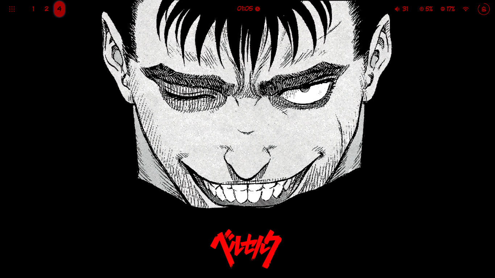
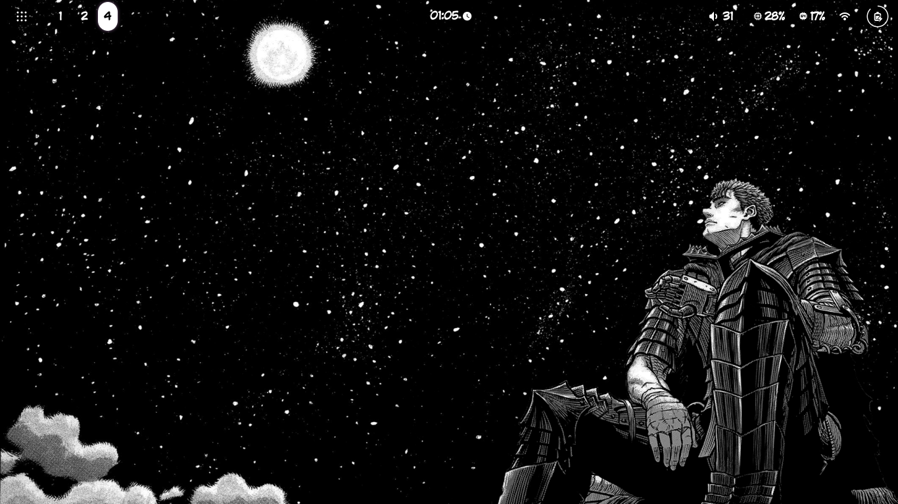

# My Dotfiles

Welcome to my dotfiles! This configuration is heavily inspired by **Berserk** and features a custom setup using [AGS (Aylur's GTK Shell)](https://github.com/Aylur/ags/) along with **Hyprland**.

## Features

- **Window Manager**: Hyprland for dynamic tiling and smooth performance.
- **Shell**: Custom GTK theming using [AGS](https://github.com/Aylur/ags/).
- **Inspired by**: The aesthetics of the manga/anime **Berserk**.

## Screenshots

Here are some screenshots of my desktop setup:

### AGS in Action


### Custom Configurations


## Getting Started

To use this configuration:

1. Clone the repository:
    ```bash
    git clone https://github.com/Nebton/dotfiles.git
    cd dotfiles
    ```
2. Install **Hyprland** and [AGS](https://github.com/Aylur/ags/).
3. Copy the dotfiles to your home directory:
    ```bash
    cp -r .config/* ~/.config/
    ```
4. Restart your window manager or log out and log back in to apply the changes.

## Notes

- These dotfiles are optimized for a system running **Hyprland** with a GTK environment.
- Ensure you have all dependencies installed as required by [AGS](https://github.com/Aylur/ags/).


