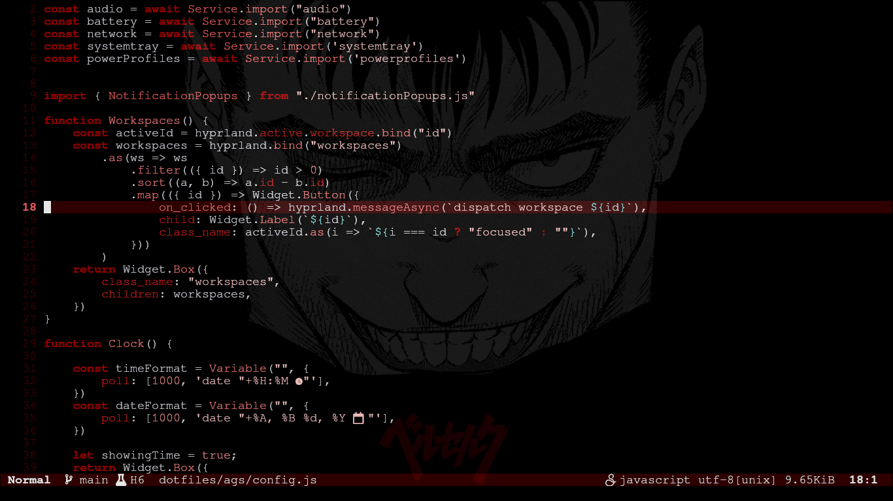

# Berserk Color Scheme

**Berserk.nvim** is a dark, high-contrast Neovim color scheme inspired by the intense and moody aesthetics of the manga *Berserk*. It features a black background, red highlights, and carefully chosen accent colors to provide a visually appealing coding environment.

## Installation

### Manual Installation

1. **Download the Color Scheme**:  
   Download `berserk.lua` and save it to your Neovim colors directory:

   ```bash
   mkdir -p ~/.config/nvim/colors
   cp berserk.lua ~/.config/nvim/colors/
   ```

2. **Apply the Color Scheme**:  
   Add the following line to your Neovim configuration file (`init.vim` or `init.lua`):

   ```lua
   vim.cmd.colorscheme 'berserk'
   ```

3. **Restart Neovim**:  
   Open Neovim again to see the new color scheme in action.

## Preview

Here's a preview of the **Berserk.nvim** color scheme:

